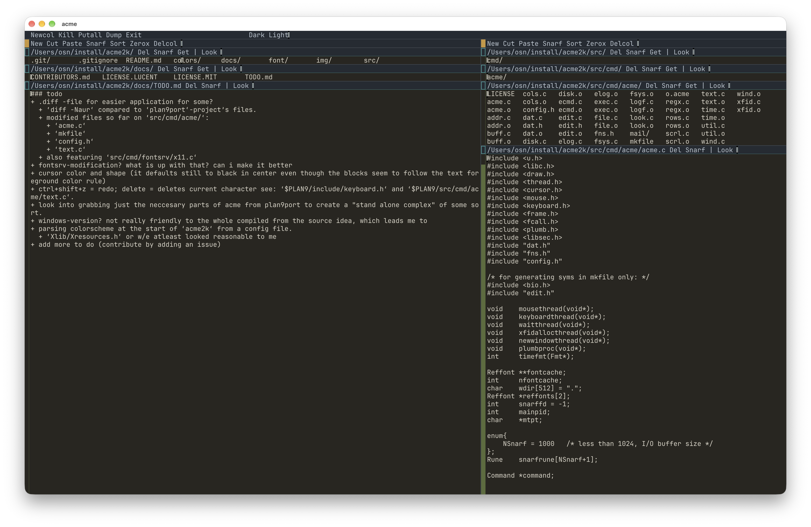

# acme2k — with light/dark themes



A fork of [acme2k](https://github.com/karahobny/acme2k) (itself a fork of plan9port's acme) with switchable light and dark themes.

## Changes from upstream acme2k

- **Runtime theme switching.** Type `Dark` or `Light` in any window or column tag and B1-click it (same as `Put` or `Font`) to switch the entire UI while acme is running.
- **Classic light mode.** The light scheme is the authentic original acme colors — the yellowish text background, teal highlights, and white desktop you know from classic acme.
- **A new, optimized dark mode.** The original acme2k dark scheme painted almost everything one color, with blinding white empty desktop showing through wherever there was no column. This fork defines 16 distinct palette slots (tag background/foreground, highlighted text, window/column/scroll buttons, desktop, borders, ...) so the dark elements are actually distinguishable from each other, and the desktop is dark too.
- **Compile-time default theme.** Set `darkmode` in `src/cmd/acme/config.h` to choose which scheme acme starts with.
- **Bart mode is a command line option again, with reversed meaning.** Default is click-to-focus: typing goes to the window you last clicked, not wherever the mouse happens to be. Pass `-b` to get the classic focus-follows-mouse behavior back.
- **A single caret.** In the default click-to-focus mode, the caret is shown only in the focused window and follows your clicks. Classic acme shows a caret in every window at its last insertion point; pass `-b` for that behavior.

## Install

Replace plan9port's acme source and build:

```sh
cp -r src/cmd/acme $PLAN9/src/cmd/acme
cd $PLAN9/src/cmd/acme && mk install
```

The fonts under `font/` (profont, mntcarlo) also need to be copied to `$PLAN9/font/`.

## Disclaimer

The changes in this fork were made with AI assistance (coding agent sessions). The upstream acme2k code, warts and purple comments included, is karahobny's.

## License

Same as upstream acme2k: modifications under [MIT](docs/LICENSE.MIT), on top of plan9port's [Lucent Public License](docs/LICENSE.LUCENT).
